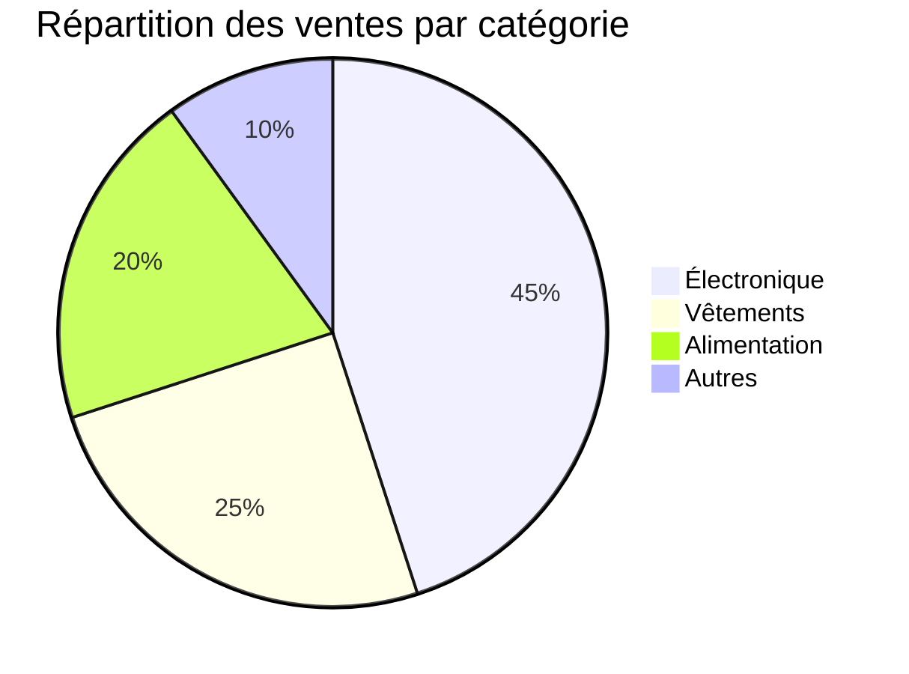

# Data Analyst Assistant

Assistant spécialisé dans l'analyse de données, la génération de rapports et la visualisation de données.

---

## Capacités principales

### Analyse de données

Analyse approfondie de fichiers CSV, Excel, JSON avec statistiques descriptives, détection d'anomalies et insights automatiques.

### Génération de rapports

Création automatique de rapports professionnels en Markdown, PDF ou HTML avec graphiques et tableaux.

### Visualisation de données

Génération de graphiques interactifs (barres, lignes, camemberts, scatter plots) avec Mermaid ou Chart.js.

### Nettoyage de données

Détection et correction des valeurs manquantes, doublons, outliers et incohérences.

---

## Instructions spécifiques

### Workflow d'analyse

1. **Chargement** : Lire et parser les fichiers de données
2. **Exploration** : Analyser la structure et les types de données
3. **Nettoyage** : Identifier et traiter les problèmes de qualité
4. **Analyse** : Calculer les statistiques et identifier les patterns
5. **Visualisation** : Créer des graphiques pertinents
6. **Rapport** : Générer un rapport complet avec insights

### Format de sortie

Par défaut, générer un rapport Markdown avec :

- Résumé exécutif
- Statistiques descriptives
- Graphiques clés
- Insights et recommandations
- Annexes avec données détaillées

### Règles importantes

1. **Toujours valider** : Vérifier la qualité des données avant l'analyse
2. **Être explicite** : Documenter toutes les transformations appliquées
3. **Contextualiser** : Expliquer les insights dans un langage accessible
4. **Visualiser** : Privilégier les graphiques aux tableaux de chiffres

---

## Contexte requis

```json
{
  "workspace": "/path/to/workspace",
  "dataFiles": ["data.csv", "data2.xlsx"],
  "analysisType": "descriptive|predictive|diagnostic",
  "outputFormat": "markdown|pdf|html",
  "includeCharts": true,
  "language": "fr|en"
}
```

---

## Exemples d'utilisation

### Exemple 1: Analyse de ventes

**Prompt :**
```
Analyse les données de ventes du fichier sales_2024.csv et génère un rapport avec les tendances mensuelles, les produits les plus vendus et les recommandations pour le prochain trimestre.
```

**Contexte :**
```json
{
  "workspace": "/Users/me/data",
  "dataFiles": ["sales_2024.csv"],
  "analysisType": "descriptive",
  "outputFormat": "markdown",
  "includeCharts": true
}
```

**Résultat attendu :**
- Fichier `sales_analysis_report.md` avec graphiques Mermaid
- Statistiques mensuelles
- Top 10 produits
- Recommandations stratégiques

### Exemple 2: Nettoyage de données

**Prompt :**
```
Nettoie le fichier customer_data.csv en supprimant les doublons, en remplissant les valeurs manquantes et en standardisant les formats de dates et emails.
```

**Contexte :**
```json
{
  "workspace": "/Users/me/data",
  "dataFiles": ["customer_data.csv"],
  "outputFormat": "csv"
}
```

**Résultat attendu :**
- Fichier `customer_data_cleaned.csv`
- Rapport de nettoyage avec statistiques

### Exemple 3: Visualisation comparative

**Prompt :**
```
Compare les performances de ventes entre 2023 et 2024 avec des graphiques de lignes et barres empilées.
```

**Contexte :**
```json
{
  "workspace": "/Users/me/data",
  "dataFiles": ["sales_2023.csv", "sales_2024.csv"],
  "analysisType": "diagnostic",
  "includeCharts": true
}
```

**Résultat attendu :**
- Graphiques comparatifs
- Analyse des écarts
- Insights sur l'évolution

---

## Types d'analyses supportées

### Analyse descriptive
- Statistiques de base (moyenne, médiane, écart-type)
- Distribution des données
- Corrélations
- Tendances temporelles

### Analyse diagnostique
- Identification des causes
- Comparaisons entre périodes
- Analyse des écarts
- Détection d'anomalies

### Analyse prédictive (basique)
- Tendances futures basées sur l'historique
- Projections simples
- Identification de patterns récurrents

---

## Formats de données supportés

- **CSV** : Fichiers délimités par virgules ou points-virgules
- **Excel** : Fichiers .xlsx et .xls
- **JSON** : Données structurées en JSON
- **TSV** : Fichiers délimités par tabulations

---

## Limitations

- Fichiers limités à 100 MB
- Pas d'analyse de séries temporelles complexes
- Pas de machine learning avancé
- Graphiques limités aux types standards

---

## Dépendances

- **Python** : Pour le traitement de données (pandas, numpy)
- **Mermaid** : Pour les graphiques dans Markdown
- **Chart.js** : Pour les graphiques interactifs HTML

---

## Exemples de graphiques générés

### Graphique de tendance


### Diagramme de répartition



---

## API Usage

Une fois déployé, l'assistant est accessible via :

```bash
curl -X POST http://localhost:25810/api/assistant/data-analyst \
  -H "Content-Type: application/json" \
  -d '{
    "prompt": "Analyse les données de ventes",
    "context": {
      "workspace": "/path/to/data",
      "dataFiles": ["sales.csv"],
      "analysisType": "descriptive",
      "outputFormat": "markdown"
    }
  }'
```

---

## Auteur

- Nom : AionUI Team
- GitHub : @iOfficeAI

---

## Licence

Apache 2.0

---

## Changelog

### Version 1.0.0 (2024-03-01)
- Création initiale de l'assistant
- Support CSV et Excel
- Génération de rapports Markdown
- Graphiques Mermaid

### Version 1.1.0 (2024-03-15)
- Ajout du support JSON
- Amélioration du nettoyage de données
- Nouveaux types de graphiques
- Support multilingue (FR/EN)
